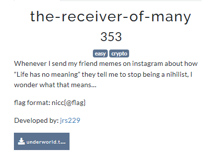
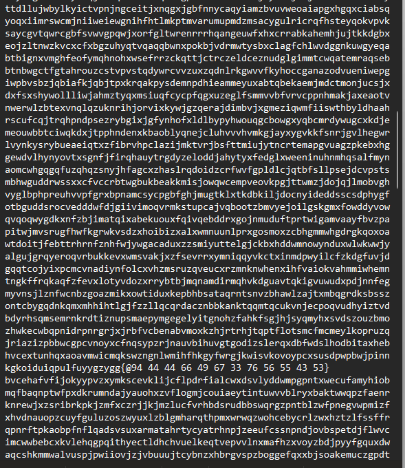
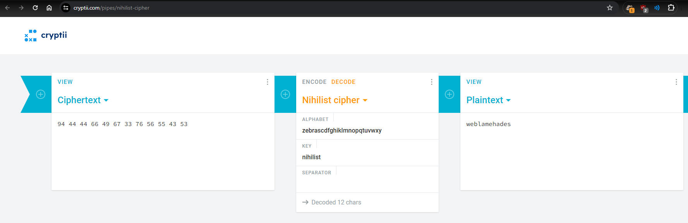
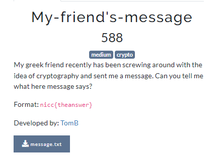
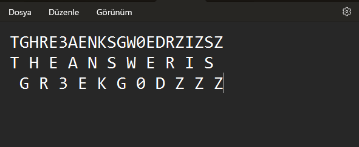

# Crypto
## The-Reciever-Of-Many

We get a large text file that looks like this:

the https://www.dcode.fr/cipher-identifier suggests that it is a nihilist-cipher and this part looks like the encrypted-flag:
`94 44 44 66 49 67 33 76 56 55 43 53`

After decrypting it we get the flag:

`nicc{@weblamehades}`

## My-friend's-message

We get this cipher:
`TGHRE3AENKSGW0EDRZIZSZ`
The words can be recognized a bit and I guess those are shifted in some sort. After shifting it we get the flag:

`nicc{thegr3ekg0dzzz}`