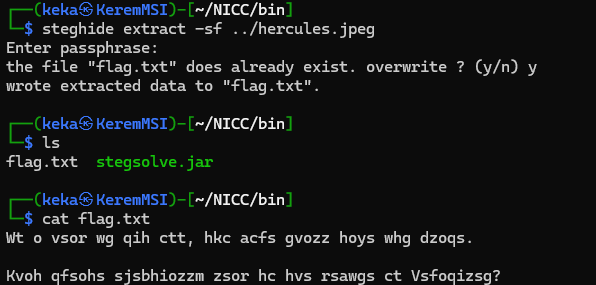

# Misc
## Bad-Singing


Using a spectrum analyzer we get the flag

`nicc{jump_in}`

## Horsing-Around-at-Troy


With binwalk we can see that there are multiple files in the jpg


After we extract them with:
```
binwalk -e totally-innocent-horse.jpg
```

We get 15 more images or so and one of them contains the flag
```
eog greek.png
```


`nicc{7Ro14-ll1pPo2}`

## Labours-of-hercules-1

Using steghide and putting the phrase as password we extract the `flag.txt`:
```
steghide extract -sf ../hercules.jpg
```

`flag.txt` contains this:
**How many days/months did Hercules have to kill the create picture depicted here?**

`nicc{thirty_days}`

## Strange-Historical-Machine


The image we get is an image of an enigma machine from WWII


After using binwalk we get the following text:
**H pzyr wuplgj flbo kmiovyiezv bz amiatez, fpc ynnttrhl hzckv lxkoglk eaqfjlsb sbz dolkqjdw kytksjzktz. Dmvyp fcz nbtleutxh pvgc tyrznyelzdn xqrlbxk hjdb lki iyzg. ftye{E0G_MS0L_3J1AGW_N0Q3}**

Using enigma decoder from https://www.dcode.fr/enigma-machine-cipher we get the following plaintext:
**I have always been interested in history, and learning where various theories and machines originated. There are certainly some interesting cyphers from the past. nicc{Y0U_KN0W_3N1GMA_C0D3}**
`nicc{Y0U_KN0W_3N1GMA_C0D3}`

## Labours-of-hercules-2

Using steghide we get the following cipher:

**Wt o vsor wg qih ctt, hkc acfs gvozz hoys whg dzoqs.**

**Kvoh qfsohs sjsbhiozzm zsor hc hvs rsawgs ct Vsfoqizsg?**

Using dcode.fr's cipher identifier we find out that it is most likely a ROT Cipher


`nicc{Lernaean_Hydra}`

## Virtual-spring


After opening the code on chrome we see that the .js code is heavily obfuscated(You are forgiven Daniel :) )


After analyzing the code basically there are many functions wiht the name [a-z0-9]

I dont believe my solution is the most intuitive but basically I did put breakpoints on every function and used the debugger to note down what functions were called in order

After debugging it we get the following:
**thespringbouncesuncontrollably**
`nicc{thespringbouncesuncontrollably}`