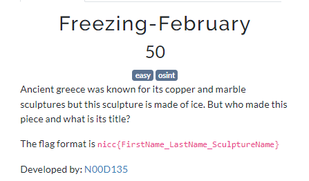
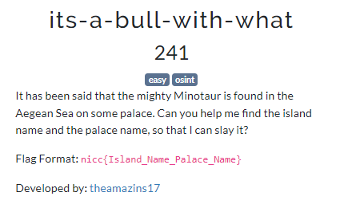

# OSINT
## Freezing-February

After image search with google we find an article(https://www.bxtimes.com/times-square-ice-sculpture/) with this sculptre

`nicc{Lovie_Pignata_Smitten}`

## Its-a-bull-with-what

This is more or less a google search. I searched "Aegean Sea minotaur palace" and after some research found out that it rest on Palace of Minos in Knossos

`nicc{Crete_Palace_of_Minos}`