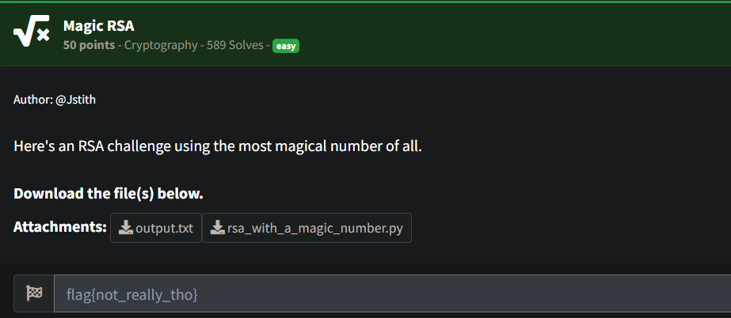

# Magic RSA

## Description



## Solution

We get 2 files, one of them contains the ciphertext, the semi-prime. And the other contains an imlementation of RSA

**output.txt:**
```
Semiprime:
N: 292661735803169078279687796534368733968232055929694715453717384181208539846645017378459508481927733219065809706996972833902743250671173212610674572380079245835772007065919936022084401497853611610920914306013040436502207047619016113234947051878549793269852855316328078769491183468515501156324665790842023112309668506350354977653838139155232422868462129041940364012648613391176971689126513558396465218392059219609662829793402841289708970576750698757213264731256720405308346659459733504680423032430634001779369250142543104703669906030549585514247663929431837546466696121103600101025434247152431200408744676625328330247569014313252820778269086840631297075563756934662979588351413726196027845505808290890109883253252054958997436359016852222176230489468164288277709046892991459049248340800616885136366469783271661343653314539194467688757972713531491290238432270971346559967725437118531023032768463200227986539449334624183071042562539584305305367245588508498775214112729500313280502474837332653452065755426475638743763861804587979560695676963674789819860296303566053542883415223272958687917330474367563315425617320128680682444959701586681495270336801802382200546403246134181793704030611664095075430115127507174884551339452808218398863888817
Ciphertext:
1061208 1259712 912673 1092727 1860867 175616 166375 941192 185193 1030301 941192 185193 912673 140608 175616 185193 140608 941192 970299 1061208 175616 912673 117649 912673 185193 148877 912673 125000 110592 1030301 132651 132651 1061208 117649 117649 1061208 166375 1953125
```

**rsa_with_a_magic_number.py:**

```
from secrets import randbits
from sympy import nextprime

e = 3

def encrypt(inp):
	p = nextprime(randbits(2048))
	q = nextprime(randbits(2048))
	n = p * q
	enc = [pow(ord(c), e, n) for c in inp]
	return [n, enc]

plaintext = open('flag.txt').read()

with open('output.txt', 'w') as f:
    data = encrypt(plaintext)
    f.write(f'Semiprime:\nN: {data[0]}\nCiphertext:\n')
    f.write(''.join(f'{b} ' for b in data[1]))
    f.write('\n\n')
```

Now when we look at the ciphertext we can notice that it is relatively short and the semi-prime N is really large and secure. The problem with this implementation is that, `e=3` is really small and if we look at this line:
```
enc = [pow(ord(c), e, n) for c in inp]
```
we can see that the encrypted part is calculated like this  `ord(c)^e mod N` 
Because `ord(c)^3 < N` the modulo operation doesnt have any effect to the encryption process, this means that we dont have to defactorize N
We can simply calculate the cube root of the Ciphertext and decrypt the message

I have wrote a simple python script to take cube root of every character like this:
```
import math

n = 292661735803169078279687796534368733968232055929694715453717384181208539846645017378459508481927733219065809706996972833902743250671173212610674572380079245835772007065919936022084401497853611610920914306013040436502207047619016113234947051878549793269852855316328078769491183468515501156324665790842023112309668506350354977653838139155232422868462129041940364012648613391176971689126513558396465218392059219609662829793402841289708970576750698757213264731256720405308346659459733504680423032430634001779369250142543104703669906030549585514247663929431837546466696121103600101025434247152431200408744676625328330247569014313252820778269086840631297075563756934662979588351413726196027845505808290890109883253252054958997436359016852222176230489468164288277709046892991459049248340800616885136366469783271661343653314539194467688757972713531491290238432270971346559967725437118531023032768463200227986539449334624183071042562539584305305367245588508498775214112729500313280502474837332653452065755426475638743763861804587979560695676963674789819860296303566053542883415223272958687917330474367563315425617320128680682444959701586681495270336801802382200546403246134181793704030611664095075430115127507174884551339452808218398863888817

def integer_cube_root(n):
    """Returns the integer cube root of a number n."""
    return round(n ** (1/3))

def decrypt(ciphertext, e=3):
    """
    Decrypts the given ciphertext which was encrypted using a small exponent e=3
    and the condition that m^3 < N.
    """
    plaintext = ''
    for c in ciphertext:
        # Calculate the integer cube root of the ciphertext value
        m = integer_cube_root(c)
        # Convert the integer value back to the corresponding ASCII character
        plaintext += chr(m)
    return plaintext

# Given ciphertext
ciphertext = [
    1061208, 1259712, 912673, 1092727, 1860867, 175616, 166375, 941192,
    185193, 1030301, 941192, 185193, 912673, 140608, 175616, 185193,
    140608, 941192, 970299, 1061208, 175616, 912673, 117649, 912673,
    185193, 148877, 912673, 125000, 110592, 1030301, 132651, 132651,
    1061208, 117649, 117649, 1061208, 166375, 1953125
]

plaintext = decrypt(ciphertext)
print(plaintext)
```

And we get the flag

