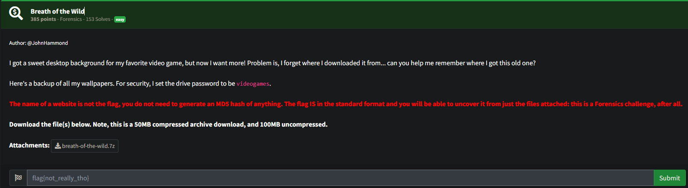
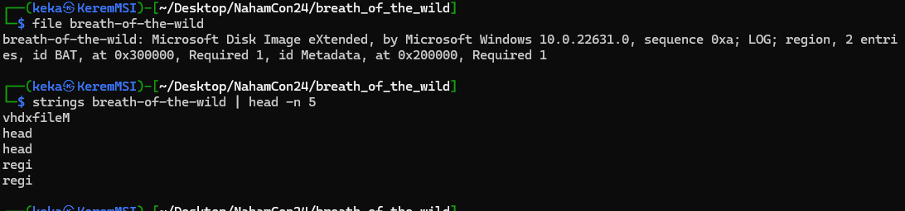
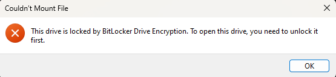
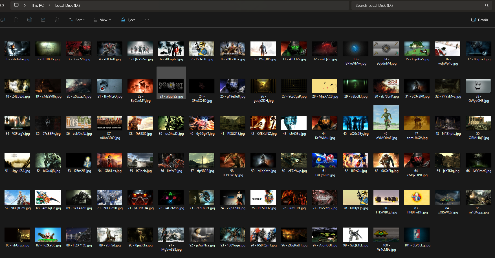
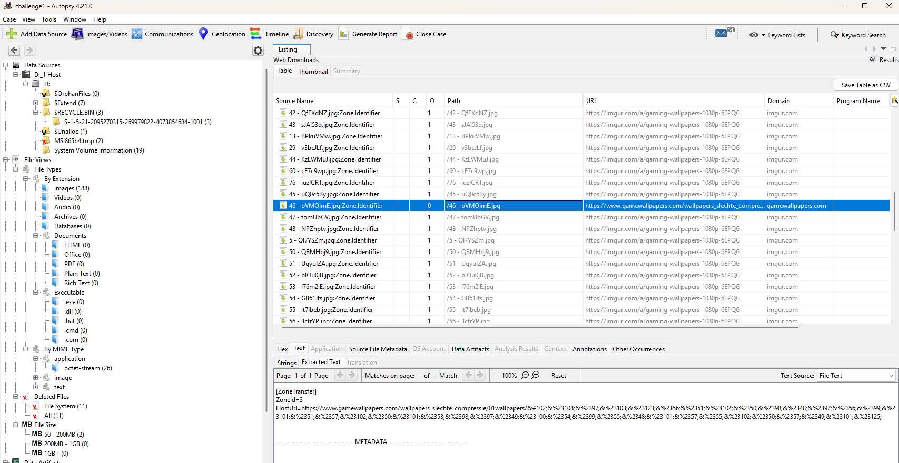

# Breath-of-the-wild
## Description

## Solution

We get disk image file requested to do some forensic analysis on it. First we determine the type of this image file:

It seems like it is a `.vhdx` image file so lets add the extension name(so windows can interpret it) and mount to see what is in it:

We are also given the password of the image so lets unlock it by `This PC->Right Click on the drive->Unlock Drive->Enter password`.

After looking into it it contains multiple images:

Lets analyze the drive in Autopsy to see if we can find some more information:

All of the images were downloaded from same website except this one image which contains some weird URL encoded data
`HostUrl=https://www.gamewallpapers.com/wallpapers_slechte_compressie/01wallpapers/&#102;&%23108;&%2397;&%23103;&%23123;&%2356;&%2351;&%23102;&%2350;&%2398;&%2348;&%2397;&%2356;&%2399;&%23101;&%2351;&%2357;&%23102;&%2350;&%23101;&%2353;&%2398;&%2397;&%2349;&%23100;&%2354;&%2399;&%2355;&%2348;&%23101;&%2357;&%2355;&%23102;&%2350;&%2357;&%2349;&%23101;&%23125;`

After decoding it we get the flag

