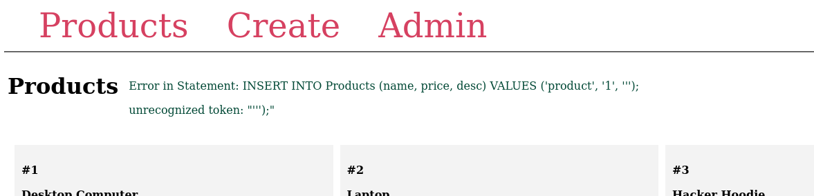

# HackerWebStore
## Description

## Solution

We have a webpage that allows us to create products and show them:

After some recon we can find out that creating a product is vulnerable to SQLi because putting **single quote** give the following error:

Now we have our **sink** and its time to weaponize our payload. Its apparent that the error looks like an **sqlite3** error. We can use string concatination `||` to retrieve other information and append it as a value of the given **INSERT** statement.

**Payload:**
First we close the input string with `'` and concatenate the `Select password From users Where id=1` query's result to that empty string. After that we have close the INSERT statement with `);` and comment out the rest with `--`.

So the final payload will look like this:
`'||(Select password From users Where id=1)); --`

**Note:**
Although there are proper methods to enumarate the database and table structure we can do some educated guesses for this challange like(users,username,user,pass,password... etc)

Now we can change the payload a bit and get the username of the hash aswell
`'||(Select password From users Where id=1)||(Select name From users Where id=1)); --`

After some recon via changing **id** we get the following users with hashes:

This is where I got stuck for a long time because the format is not supported by `hashcat` or `john`. After multiple hours of research trial and error i have come across this implementation here(https://defuse.ca/php-pbkdf2.htm) which suggests that the last bit of the hash is hex encoded. The hashcat needs the following format:
`pbkdf2_sha256$iter$salt$hash(b64 encoded)`

So we change the hash of the admin from this `pbkdf2:sha256:600000$MSok34zBufo9d1tc$b2adfafaeed459f903401ec1656f9da36f4b4c08a50427ec7841570513bf8e57`
to this
`pbkdf2_sha256$600000$MSok34zBufo9d1tc$sq36+u7UWfkDQB7BZW+do29LTAilBCfseEFXBRO/jlc=`

Note that for the last part is changed with **hex->binary->base64**

After the conversion we can crack with hashcat using the given wordlist:
`hashcat -m 10000 admin.txt -a 0 wordlist.txt`

Now we can login to the admin account with the password and retrieve the flag!

# The Davinci Code
## Description

## Solution

We get a simple webpage that we can only navigate to `/code` page which returns an error that contains some debugging information like below:

Apparently the application tries to open the file `code.html` but it cant find it. After checking the debug information something catched my eye:

Lets send a OPTIONS request instead of a GET request with burp suite

It also accepts PROPFIND requests which suggest its probably a WebDAV server. After some recon we can also findout that the server accepts the MOVE request aswell which basically moves files across the server. With PROPFIND we can identify the folder structure and find a secret folder called `/the_secret_dav_inci_code` and this folder contains `flag.txt`.

But when we try to open the page http://challenge.nahamcon.com:31305/the_secret_dav_inci_code/flag.txt we get an 404 not found error.

But why dont we let the server read us instead of trying to read it. MOVE request in WebDAV functions similar to `mv` command in linux which meand that we can rename the file aswell. Since the server tries to open the /template/code.html we can move flag there as a html file. We specify the `Destination` header to the location we want and send the request:

Now when we open the /code page we get the flag

