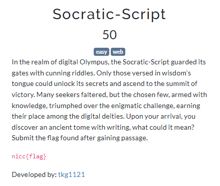
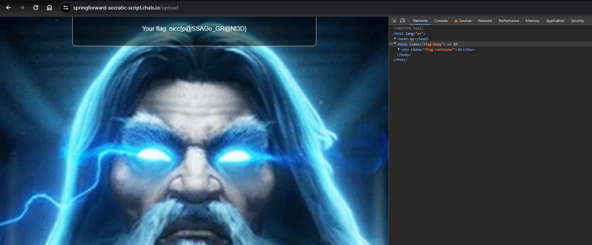

# Web
## Socratic-Script

After analyzing the source code we find that the webpage contains a script that prevents us submitting the passphrase

We can disable js from dev tools with ctrl+shift+P and select disable js

After we upload the passphrase file that we are given, we get the flag

`nicc{p@SSAGe_GR@Nt3D}`

## Into-the-Gorgons'-Den

This challenge has 3 parts to for the solutions:

### Part 1

After looking at the js code we find that the mirror function just reverses the input and if that input results in "perseus" in reverse we get a hint

There is also script that sends a request for the solution every minute and it will be revealed only at 28th minute for the server. We wait until we get the solution to the Part 1

At the time of writing I cant get the flag but it was `sl4y`

### Part 2

After analyzing this cipher in dcode.fr we find out that it is ROT-13 Cipher and decode it to get this(You can also try to understand the js to find out that all chars are shifted 13):

**The second part of the flag is the but the e is a 3 !**

So the solution to the part 2 is `th3`

### Part 3 

We can send all we collected and recieve the final parts solution

**nicc{part1_part2_g0rg0n}**

`nicc{sl4y_th3_g0rg0n}`

### Alternative solution(fast):

The `sl4yth3` is hardcoded in the js you can basically visit /fetch_flag.php and get the last part and combine it to get the flag

